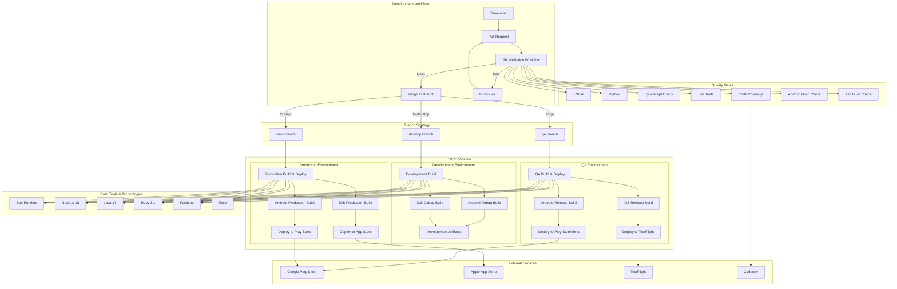
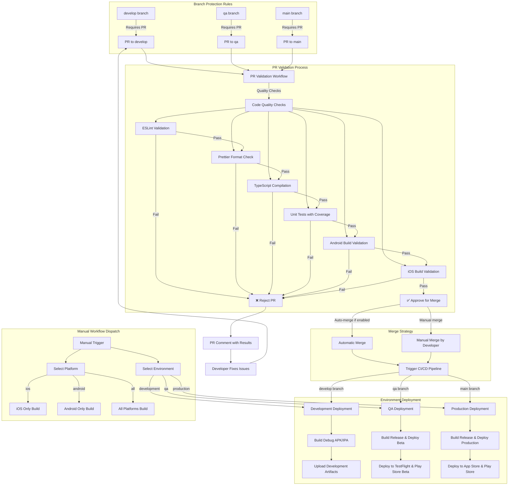

# CI/CD Architecture Overview

## High-Level Architecture Diagram

## Merge Flow Diagram

## Key Architecture Components

### 1. PR Validation Workflow (`pr-validation.yml`)
- **Trigger**: Pull requests to `develop`, `main`, or `qa` branches
- **Purpose**: Quality gate before code merge
- **Validations**:
  - Code quality (ESLint, Prettier, TypeScript)
  - Unit tests with coverage reporting
  - Android build validation
  - iOS build validation (limited on Ubuntu)
  - Automatic PR commenting with results

### 2. Mobile CI/CD Workflow (`mobile-ci-cd.yml`)
- **Trigger**: Push to branches or manual workflow dispatch
- **Environments**:
  - **Development** (`develop` branch): Debug builds, artifact uploads
  - **QA** (`qa` branch): Release builds, beta deployments
  - **Production** (`main` branch): Production builds, store deployments

### 3. Build Technology Stack
- **Runtime**: Bun (primary), Node.js 18
- **Mobile**: React Native with Expo
- **Build Tools**: Fastlane for iOS/Android automation
- **Languages**: Java 17 (Android), Ruby 3.1 (Fastlane)
- **Package Management**: npm/bun for dependencies

### 4. Deployment Strategy
- **Development**: Debug builds, local artifact storage
- **QA**: Beta releases to TestFlight (iOS) and Play Store Beta (Android)
- **Production**: Full releases to App Store (iOS) and Play Store (Android)

### 5. Quality Assurance
- **Automated**: ESLint, Prettier, TypeScript, unit tests
- **Coverage**: Codecov integration for test coverage tracking
- **Build Validation**: Cross-platform build verification
- **Manual Gates**: Production deployments require manual approval

### 6. Artifact Management
- **Development**: 7-day retention for debug builds
- **QA**: 14-day retention for beta builds
- **Production**: 30-day retention for release builds

This architecture provides a robust, multi-environment CI/CD pipeline with comprehensive quality gates and automated deployment capabilities for React Native mobile applications.
